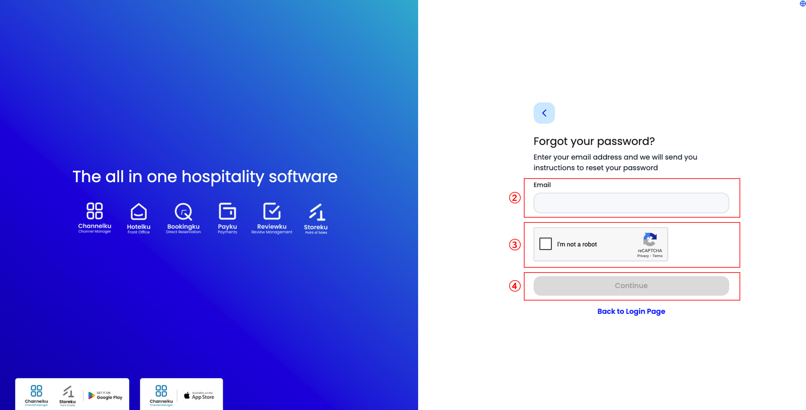

# Technical Writer Test

# [User Guide & API Reference](#user-guide--api-reference)

## [Section 1: User Guide – Login with Single Sign-On (SSO)](#section-1-user-guide--login-with-single-sign-on-sso)

### 🔎 [**What is SSO?**](#-what-is-sso)

---

**Single Sign-On (SSO)** is a login method that allows users to using **one account** (for example, a company email account) to access multiple applications at once.

With SSO, the login process becomes **simpler, faster, and more secure** because there is no need to remember multiple usernames and passwords.

### 📝 [How to Log In Using SSO](#-how-to-log-in-using-sso)

---

Follow these steps to log in to the application:

1. Open the application login page.
The login form will appear with fields for **Username/Email** and **Password**.
    
    
    
2. **Enter SSO account credentials.**
    - Type the registered **company email address** or **SSO username**.
    - Enter the **password**.
    - Use the 👁️ (*eye*) icon to verify that the typed password is correct.
    - (Optional) Check **Remember Me** when logging in from a personal device.
    - If the password is forgotten, click **Forgot Password** (see [Forgot Password](#forgot-password))

3. Click the `Login` button.
4. **Verify identity with OTP (One-Time Password).**
    
    After credentials are verified, the system sends an **OTP code** to the registered email address.
    
    
    
    - A notification will appear confirming that the **OTP has been sent**.
    - Enter the **6-digit OTP code** in the verification field.
    - If the OTP is not received within 5 minutes, click **Resend**.
    - (Optional) Check **Trust this device for 30 days** when using a personal device.
        
        > ⚠️ Note:
        > 
        > - When this option is enabled, the system recognizes the device and network for 30 days, so OTP input is not required during that period
        > - When disabled, OTP will be **requested every time** a login occurs, even on the same network.
5. Login Complete
    
    To confirm that the login process is successful, the system will automatically redirect to the **dashboard** page. Check the displayed **username** to ensure that the correct account is logged in.
    
    
    

### 🛠️ [Troubleshooting: Common Login Issues](#-troubleshooting-common-login-issues)

---

#### **Forgot Password**

If the password is forgotten during login:

1. Click **Forgot Password** on the login form. 
    
    The system will redirect to the password reset page.
    
    
    
2. Enter the registered email address in the provided field.
    
    
    
3. Complete the **Captcha** verification.
4. Click **Continue**.
5. The system will open the password update form. Fill in the fields as follows:
    - **Password:** Enter a new password (minimum 8 characters, including uppercase, lowercase, number, and symbol).
    - **Confirm Password:** Re-enter the new password for confirmation.
    
    
       
7. Complete the **Captcha** verification again.
8. Click **Update Password**.
9. After a successful reset, a confirmation message appears, and the system redirects back to the **Login** page. Log in again using the **email** and **new password**.


### ⚠️ Security Tips When Using SSO

---

To maintain account security when using Single Sign-On (SSO), pay attention to the following:

<details>
  <summary>Manage Passwords Safely</summary>

- **Never** share the account or password with others.  
- **Change** passwords periodically (3-6 months) to reduce misuse risk.  


1. Open the **Change Password** menu.  
2. Enter the current password in the **Old Password** field.  
3. Enter a new password in the **New Password** field. Use a **strong password** (minimum 8 characters combining uppercase, lowercase, numbers, and symbols). Avoid reusing the old password.  
4. Re-type the new password in the **Re-type Password** field. Use the **👁 (eye)** icon to verify.  
5. Complete the **Captcha** verification.  
6. Click **Update Password**.  

</details>

<details>
  <summary>Secure the Device</summary>

- Avoid logging in from **public or shared devices** without logging out afterward.  
- Enable **Remember Me** only on personal devices.  
- Use **Trust this device for 30 days** only on personal devices.  
- Regularly check **Linked Devices** by following these steps:  


1. Open the **Linked Device** menu.  
2. If an unknown or unauthorized device is listed, click **REMOVE** to revoke access.  

</details>

<details>
  <summary>Enable Multi-Factor Authentication (MFA)</summary>

MFA adds an extra security layer by requiring additional verification beyond passwords.  


1. Open the **MFA** menu on the dashboard.  
2. Choose an additional verification method (**Email** or **Google Authenticator App**) using the checkbox.  
3. Click **Save Changes** to activate MFA.  

</details>


## [**Section 2: API Reference – SplitReservation**](#section-2-api-reference--splitreservation)


### [Overview](#overview)

---

`SplitReservation` allows users to **split one reservation containing multiple rate plans** into separate reservations. Afterward, if a guest books multiple rate plans under a single reservation but needs to manage, update, or cancel them separately, this API can be used to split the reservation.

**Example:**

- A booking includes two rate plans (e.g., “Breakfast Included” and “Room Only”).
- The system can split them into two separate reservations for better management of pricing, payment, or room assignment.

### [Authentication](#authentication)

---

Every request to this API **must include a valid authorization token (Bearer Token)** in the header. The token confirms that the user is authenticated and authorized to access the data.

**Header Example:**

```
Authorization: Bearer <your_api_token>
Content-Type: application/json
```

> ⚠️ Without a valid token, the system will denies access (error **401 Unauthorized**).

### [Endpoint Details](#endpoint-details)

---

| Method | URL | Deskripsi |
| --- | --- | --- |
| **POST** | `/api/v1/split-reservation` | To split a reservation into separate parts. |
| **GET** | `/api/v1/split-reservation/{bookingNumber}` | To retrieve split results from a specific reservation number. |

### [Request Example](#request-example)

---

### POST

- **JSON Body**
    
    ```json
    {
      "bookingNumber": "R20251004",
      "roomId": 202,
      "ratePlanIds": [1011, 1012]
    }
    ```
    
- **Parameter Description**
    
    | Parameter | Type | Required | Description |
    | --- | --- | --- | --- |
    | bookingNumber | string | Yes | Original booking number to be split |
    | roomId | int | Yes | Room identifier |
    | ratePlanIds | array | Yes | List of rate plans to be split |
    
    > ⚠️ Catatan:
    > 
    > - If a reservation contains only one rate plan, splitting **cannot** be performed
    > - All rate plans in the request **must** belong to the same booking number.

### GET

- **URL**
    
    ```
    GET /api/v1/split-reservation/{bookingNumber}
    ```
    
    Example:
    
    ```
    GET /api/v1/split-reservation/R20251004
    ```
    
- **Parameter Description**
    
    | Parameter | Type | Required | Description |
    | --- | --- | --- | --- |
    | bookingNumber | string | Yes | Original booking number to view split results |

### [Response Example](#response-example)

---

| Code | Message | Meaning |
| --- | --- | --- |
| 200 | Success | Reservation successfully split |
| 400 | Invalid Request | Missing or invalid parameters |
| 401 | Unauthorized | API key or token missing/invalid |
| 500 | Internal Server Error | Unexpected issue on the server |

### ✅ [Success Response](#-success-response)

**200 Success** 

```json
{
  "status": 200,
  "message": "Reservation successfully split!",
  "data": {
    "originalBookingNumber": "R20251004",
    "newBookingNumbers": ["R20251004-1", "R20251004-2"],
    "totalSplit": 2
  }
}
```

### ❌ [Error Response](#-error-response)

**400 Bad Request**

```json
{
  "status": 400,
  "message": "Invalid request. Please check the parameters."
}
```

**401 Unauthorized**

```json
{
  "status": 401,
  "message": "Invalid or missing token."
}
```

**500 Internal Server Error**

```json
{
  "status": 500,
  "message": "Invalid or missing token."
}
```
